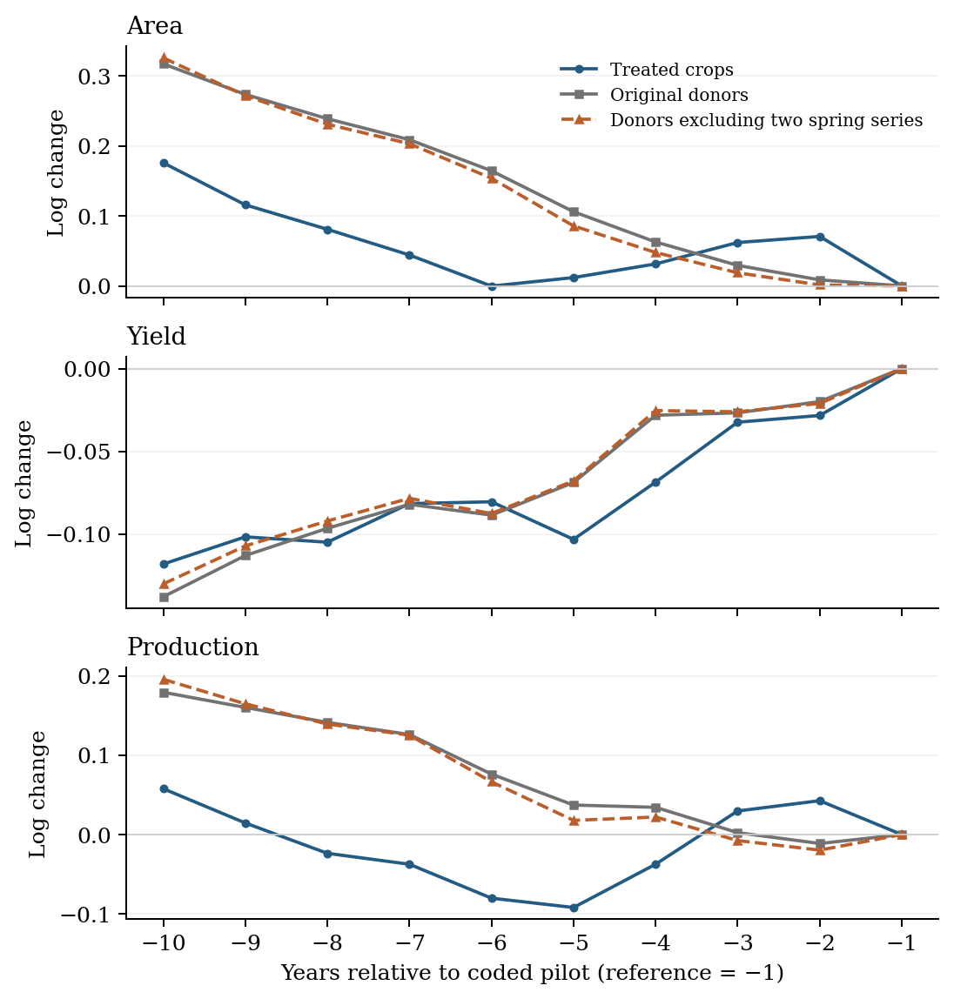
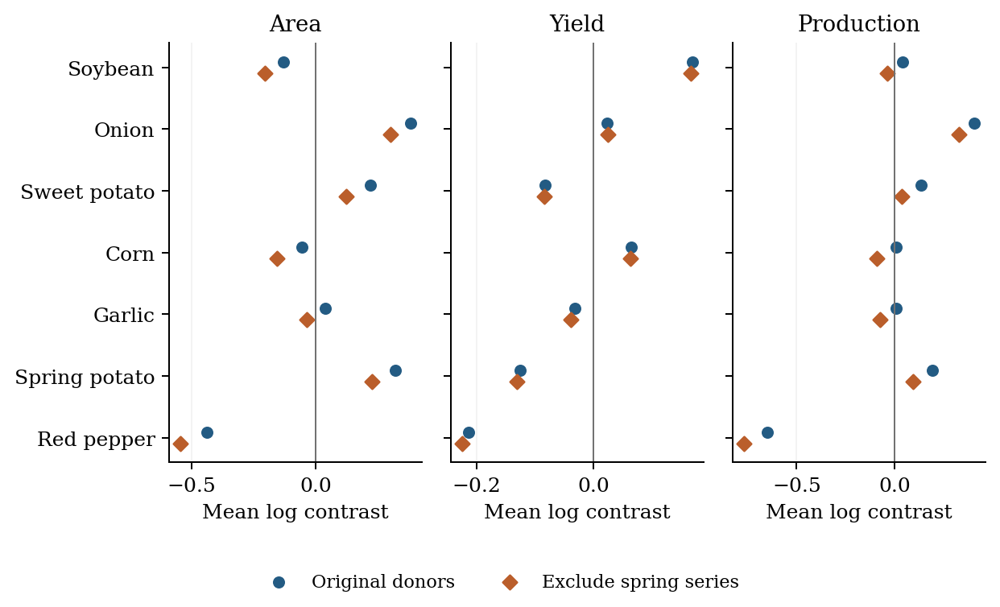
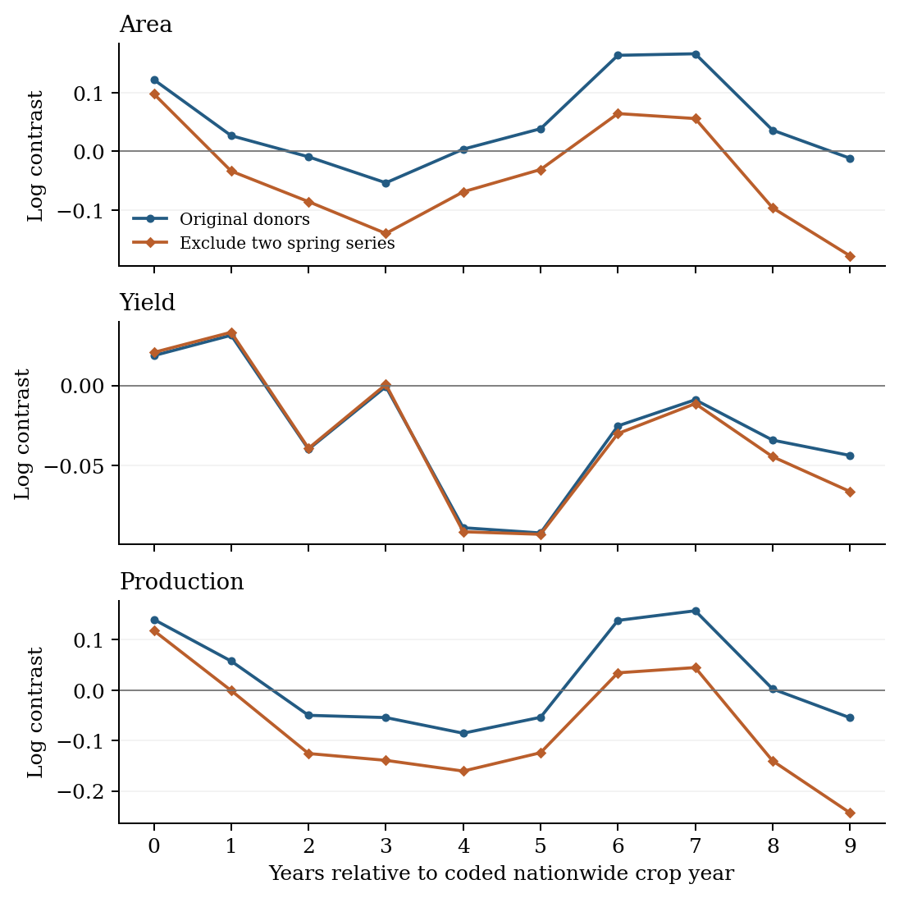
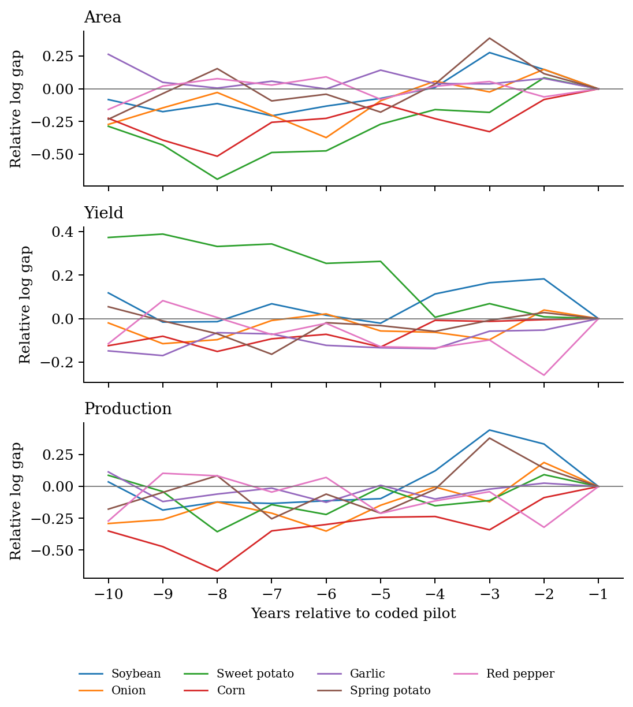

# 5 Crop Insurance Expansion and Crop Level Outcomes

This chapter examines how national crop outcomes changed following the expansion of crop disaster insurance in Korea. It complements the evaluation of government support in Chapter 4 by examining cultivated area, yield, production, and, in a smaller sample, relative farm-gate prices. These outcomes describe production and market conditions. They do not directly measure income stabilization or establish whether premium subsidies, operating-expense support, or state reinsurance are appropriately designed.

The analysis begins with a transparent comparison: the change for a crop with insurance availability relative to the change for crops that remain unexposed at the relevant dates. Its central finding is that the resulting average is sensitive to the reference period, comparison crops, and aggregation weights. A small overall production contrast combines sizeable opposing crop-specific contrasts. This chapter therefore reports the comparison and its sensitivity rather than interpreting a large p-value as evidence that insurance had no effect.

The chapter proceeds from sample construction and timing to the calculation of the comparison, observed pre-pilot trajectories, crop-specific results, and alternative specifications. The seven-crop design was established in an earlier project stage. The additional diagnostic and weighting analyses reported here were developed after the initial results had been examined. They are identified as post-result sensitivity analyses, not as preregistered tests or independent confirmations of the initial findings.

## 5.1 Data and sample construction

The reconstructed master panel contains 43 crop or crop-form series from the Korean Statistical Information Service (KOSIS), spanning 1980–2024 with source-dependent coverage. The annual-crop analysis uses 1991–2024. The observation is a national crop-year, not a farm or an insurance contract. The assembled dataset does not link individual farms' insurance participation to their production and income; this limitation does not imply that such administrative data could never be accessed through a different research arrangement.

The reference treated sample comprises soybean, onion, sweet potato, corn, garlic, spring potato, and red pepper. These series have coded national expansion dates early enough to observe event years 0–9 through 2024 and a pre-pilot history for comparison. Earlier sample selection also involved judgments about chronology, crop definitions, and comparability. The seven crops were not obtained from a fully prespecified, mechanical eligibility rule, and their retention here should not be read as proof that they form an optimal sample.

Rice remains a separate case because its chronology requires additional reconciliation and a single crop cannot separate insurance expansion from other rice-specific changes. Autumn potato is not added without resolving its crop-form timing and measurement issues. Fruit is retained as a separate supplementary analysis because orchard area and the production cycle differ from annual cultivation. Pooling these series solely to increase the number of treated observations would change the question and would not necessarily add independent policy variation.

For annual crops, cultivated area is measured in hectares, yield in kilograms per 10 ares, and production in metric tonnes. Natural logarithms express changes on a proportional scale. Let $A_{it}$, $Z_{it}$, and $Q_{it}$ denote area, yield, and production. Their accounting relationship is

$$Q_{it}=\frac{A_{it}Z_{it}}{100}.\qquad (5.1)$$

Thus, apart from discrepancies in the published series,

$$\ln Q_{it}=\ln A_{it}+\ln Z_{it}-\ln 100.\qquad (5.2)$$

Published values are retained rather than adjusted to force this identity. The accompanying checks quantify the residual in the identity and confirm that it is small for the seven treated crops. Consequently, the estimated production contrast should be approximately the sum of the area and yield contrasts when all three use the same cells and weights. This is an accounting check, not evidence of a behavioral mechanism.

The initial donor pool lists 24 annual crop series. A donor observation is eligible only before that crop's own coded pilot, or if no pilot is recorded within the study period. Twenty-two donor series contribute to at least one reference comparison. Observations for an included treated crop may also serve as controls while cleanly pre-pilot, where eligible. This eligibility rule addresses recorded insurance exposure; it does not establish that eligible crops provide a valid counterfactual.

## 5.2 Timing and the observations being compared

Insurance histories distinguish initial pilot introduction, geographical expansion, and transition to the main program. These milestones are not interchangeable. Table 5.1 retains the project's coded crop-year dates and displays the alternative product-table year rather than hiding disagreements among records. Some historical crop-year assignments rely on sales-calendar conventions drawn from later guidance, so the dates remain subject to source verification.

**Table 5.1. Coded timing for the seven annual crops**

|Crop | Pilot | National crop year | Product-table year | Reference year | Transition years|
|---|---|---|---|---|---|
|Soybean | 2008 | 2012 | 2011 | 2007 | 4|
|Onion | 2009 | 2012 | 2011 | 2008 | 3|
|Sweet potato | 2009 | 2013 | 2012 | 2008 | 4|
|Corn | 2009 | 2013 | 2012 | 2008 | 4|
|Garlic | 2010 | 2013 | 2012 | 2009 | 3|
|Spring potato | 2008 | 2013 | 2011 | 2007 | 5|
|Red pepper | 2008 | 2015 | 2014 | 2007 | 7|

Notes: “National crop year” denotes the reference coding, not a newly established historical fact. The reference year is pilot minus one; transition years run from the pilot year through national crop year minus one. Source: project treatment coding based on the Agricultural Insurance Yearbook 2025 and associated chronology records. The revision reproduces this coding and does not independently resolve the underlying historical conflicts.

For each treated crop, the last pre-pilot year is used as the reference. Pilot-to-national transition observations are excluded as untreated observations because they may already have insurance exposure. The comparison nonetheless spans that transition: it measures a change from before the pilot to a later target year. It cannot isolate the incremental effect of moving from pilot status to nationwide availability.

The reference lies four to eight years before the coded national year, rather than uniformly at national event time −1. Post-period targets are the first ten coded national event years. All seven treated crops contribute at every event year in the reference design. At the last event year, each crop has 8–11 eligible donors. This declining support is reported rather than interpreted as an unchanged comparison population.

Table 5.2 describes the actual contributing cells in raw units. Reference cells are distinguished from target cells, and treated crops from donors. Each crop-year is counted once within each group even if it enters several individual contrasts. The table is a description of observed levels, not a regression balance test or the computation of the estimator.

**Table 5.2. Descriptive statistics for contributing crop-year cells**

|Variable | Cell group | N | Crops | Mean | SD | Min | Max|
|---|---|---|---|---|---|---|---|
|Area (ha) | Treated reference | 7 | 7 | 31,958 | 24,132 | 13,033 | 76,267|
|Area (ha) | Treated target | 70 | 7 | 26,991 | 15,482 | 13,017 | 80,842|
|Area (ha) | Donor reference | 66 | 22 | 9,775 | 9,659 | 1,062 | 34,875|
|Area (ha) | Donor target | 218 | 22 | 9,083 | 10,014 | 619 | 45,474|
|Yield (kg/10a) | Treated reference | 7 | 7 | 1,934 | 2,311 | 150 | 6,725|
|Yield (kg/10a) | Treated target | 70 | 7 | 1,856 | 2,161 | 147 | 8,541|
|Yield (kg/10a) | Donor reference | 66 | 22 | 2,488 | 2,696 | 37 | 10,946|
|Yield (kg/10a) | Donor target | 218 | 22 | 2,335 | 2,757 | 30 | 11,286|
|Production (t) | Treated reference | 7 | 7 | 350,922 | 323,462 | 92,830 | 1,035,076|
|Production (t) | Treated target | 70 | 7 | 381,113 | 424,756 | 55,714 | 1,594,450|
|Production (t) | Donor reference | 66 | 22 | 208,852 | 330,283 | 1,589 | 1,582,966|
|Production (t) | Donor target | 218 | 22 | 163,544 | 295,436 | 1,598 | 1,698,463|

Notes: Unweighted raw-unit summaries of the reference donor specification; numbers are rounded to the nearest unit. N is the number of unique contributing crop-year cells within a group. Reference dates are crop-specific. All three outcomes have identical support. SD is the sample standard deviation of the listed observations and describes dispersion across crops and years. It is not the standard error of a treatment contrast. These repeated crop observations must not be treated as independent farms. Source: reconstructed KOSIS panel; reproducible cell membership and summaries accompany this chapter.

The raw means differ substantially across crops and the dispersion is large. For example, mean area is approximately 31,958 hectares among treated reference observations and 9,775 hectares among donor reference observations. This difference motivates showing raw scale alongside logarithmic comparisons. It does not itself refute parallel trends, which concerns changes in untreated outcomes rather than equality of levels. Nor should differences between the four pooled means be substituted for the matched-date comparisons below.

## 5.3 A transparent comparison and its assumptions

Let $p_i$ be the coded pilot year, $g_i$ the coded national crop year, and $b_i=p_i-1$ the reference year for treated crop $i$. At event year $e$, the target calendar year is $t=g_i+e$. The donor set $C_{i,e}$ contains crops observed and cleanly untreated at both $b_i$ and $t$; its size is $n_{i,e}$. For a log outcome $y$, the individual contrast is

$$\widehat{\delta}_{i,e}=(y_{i,g_i+e}-y_{i,b_i})-\frac{1}{n_{i,e}}\sum_{j\in C_{i,e}}(y_{j,g_i+e}-y_{j,b_i}).\qquad (5.3)$$

In words, the calculation subtracts the donors' average change over the same calendar years from the treated crop's change. An increase in this contrast can occur because the treated crop expanded, because donors contracted, or both. Its sign alone does not identify an insurance-induced response.

Each of the seven treated crops receives equal weight within an event year. Event years then receive equal weight:

$$\widehat{\theta}_e=\frac{1}{7}\sum_{i=1}^{7}\widehat{\delta}_{i,e},\qquad (5.4)$$

$$\widehat{\theta}=\frac{1}{10}\sum_{e=0}^{9}\widehat{\theta}_e.\qquad (5.5)$$

This is the mean of ten reference-to-target contrasts. It is not the sum of ten annual effects, a ten-year cumulative production increase, or a national output-weighted effect. The explicit comparisons share the group-time logic discussed by Callaway and Sant'Anna (2021), but the code is a custom estimator with its own reference and aggregation rules. Citing that literature does not validate this implementation or imply that a standard package estimator was used.

A causal interpretation would require, among other conditions, that in the absence of insurance the treated crop's change would have matched the eligible donors' average change. It would also require appropriate exposure timing, no relevant anticipation before the reference year, and no spillover from insurance expansion into donor outcomes. Commodity substitution, common weather shocks, crop-specific technological change, and other policies can all make those conditions doubtful. Restricting donors to clean observations cannot resolve these substantive issues.

## 5.4 Observed pre-pilot trajectories

**Figure 5.1. Fixed-composition trajectories before pilot introduction**

{width=6.15in}

Notes: All paths are log changes relative to each crop's final clean pre-pilot year. The same seven treated crops contribute at every point. Within each crop and donor specification, the donor set is fixed over pilot years −10 through −1. The two donor variants differ only by excluding spring napa cabbage and spring radish. The convergence at −1 is imposed by normalization and is not evidence of parallel trends. No sampling intervals are plotted. Source: calculations from the reconstructed KOSIS panel.

Figure 5.1 examines the observed ten years preceding each crop's pilot. All seven crops are present throughout. For each treated crop, donors are held fixed and must be observed and clean during its entire ten-year window. Every series is normalized to zero at its own final pre-pilot year. The figure averages the seven treated paths and their seven corresponding donor averages with equal crop weights. Donor sets may differ across treated crops, but they do not change along an individual pre-pilot path.

This construction avoids interpreting changing pre-period composition as an outcome trend. It does not impose parallel trends, choose donors to obtain a favorable pretrend test, or establish their suitability for later years. The longer clean-window requirement also means that its donor sets differ from some post-period comparisons.

The area and production paths do not move together throughout the pre-pilot window. Treated area initially declines and then partially recovers relative to a more steadily declining donor path; production displays a related divergence. Yield paths are more similar on average, although individual crops differ. Removing the two spring series produces similar pre-pilot averages, so that exclusion alone does not eliminate the observed pretrend concern. Appendix Figure A5.1 shows the individual crop gaps that aggregate into these patterns.

A non-rejection in a joint pretrend test would not establish the required counterfactual. Tests can have low power, and selecting specifications after observing test outcomes creates further problems (Roth, 2022). The figure is therefore presented as a diagnostic of the actual comparison, without significance stars or confidence bands whose coverage has not been established.

## 5.5 Aggregate contrasts and the limits of inference

Table 5.3 reports the reference results alongside exclusion of spring napa cabbage and spring radish. The latter comparison addresses an unresolved measurement concern around the appearance of winter-form series in 2014. Exclusion is not treated as confirmation that the original series are erroneous, and no unverified spring–winter reconstruction replaces the observed data.

The table separates the point contrast from its reported uncertainty calculation. The analytic SE and nominal interval come from the existing crop-score multiplier implementation, frozen in the September 30 reanalysis. The original procedure uses Webb's six-point multiplier distribution and 9,999 draws. It is not automatically equivalent to a validated, null-imposed wild cluster bootstrap test for this custom estimator. The few-treated-cluster literature warns that even established bootstrap procedures can perform poorly in some such designs (MacKinnon & Webb, 2018).

**Table 5.3. Mean post-period contrasts and diagnostic uncertainty**

|Donors | Outcome | Contrast | Score SE | Nominal 95% interval | Diagnostic p|
|---|---|---|---|---|---|
|Original donors | Area | 0.048 | 0.139 | [−0.221, 0.317] | 0.734|
|Original donors | Yield | −0.028 | 0.055 | [−0.131, 0.075] | 0.603|
|Original donors | Production | 0.020 | 0.159 | [−0.281, 0.321] | 0.908|
|Exclude spring series | Area | −0.041 | 0.134 | [−0.294, 0.211] | 0.758|
|Exclude spring series | Yield | −0.032 | 0.058 | [−0.143, 0.079] | 0.588|
|Exclude spring series | Production | −0.074 | 0.157 | [−0.371, 0.224] | 0.652|

Notes: Log outcomes; event years 0–9; seven treated crops in both variants. Original donors comprise 22 contributing series, versus 20 after the spring-series exclusion. “Score SE” is the stored analytic score-based quantity, not a bootstrap standard deviation. Intervals are the estimate plus or minus the 95th percentile of the absolute multiplier score sum. The intervals and p-values are reported for transparency, not as validated coverage or calibrated hypothesis tests. Source: September 30 frozen original-multiplier output; seed 20260930, 9,999 draws. Point estimates have been separately reproduced in this revision. Appendix A5.1 explains the procedure and its limitations.

With original donors, the mean contrasts are 0.048 for area, −0.028 for yield, and 0.020 for production. Excluding the two spring series changes them to −0.041, −0.032, and −0.074. Area and production therefore change sign while the yield average changes less. The original production average is close to zero, but its nominal interval extends from −0.281 to 0.321 log points. Because inferential calibration is unresolved, this interval should not be used to certify either precise bounds or equivalence to zero.

The approximate accounting relationship is retained: 0.048 minus 0.028 is close to 0.020. The small residual follows from the recorded source values and identical aggregation weights. The three outcomes are thus related descriptions, not three independent confirmations of an insurance mechanism.

A previously completed simulation exercise examined the procedures under several constructed error processes. It found rejection frequencies above the nominal five-percent level in many scenarios. Those simulations do not determine which empirical contrast is correct, and their artificial samples do not increase the information in the original seven treated crops. They support treating the reported uncertainty measures cautiously. The simulation settings and results are retained in Appendix A5.1 and the supplementary files; no new simulations were conducted for this chapter revision.

## 5.6 What the seven crop comparisons contribute

Figure 5.2 reports each crop's mean contrast over event years 0–9 under both donor definitions. These points are the components of the aggregate, not separately identified crop treatment effects. Dividing each point by seven gives its contribution to the equal-crop aggregate.

Under original donors, onion's production contrast is 0.406 and spring potato's is 0.193, whereas red pepper's is −0.651. Their respective contributions to the aggregate production average are approximately 0.058, 0.028, and −0.093 log points. The other four contributions sum to approximately 0.027. Thus, the aggregate of 0.020 reflects opposing movements rather than uniformly small crop-level comparisons. These differences may reflect counterfactual mismatch and other crop-specific developments as well as any response to insurance.

Leave-one-crop-out calculations reinforce the sensitivity of the average to composition. Omitting onion gives a production contrast of −0.044; omitting red pepper gives 0.132. It would therefore be incorrect to claim that the sign is independent of individual crops. Each omission also changes the target population from seven to six crops, so these results are a dependence diagnostic rather than an alternative result to select for significance. Appendix Table A5.2 reports every omission.

**Figure 5.2. Mean contrasts for each treated crop**

{width=6.15in}

Notes: Each point averages ten crop-specific reference-to-target contrasts. Blue circles use original donors; orange diamonds exclude spring napa cabbage and spring radish. All outcomes are in log points. Horizontal scales differ across outcomes. No crop-specific confidence intervals or tests are implied. The equal-crop aggregate equals the mean of the seven points in each panel. Source: direct contrasts reconstructed from the same frozen panel and checked against the stored calculation; this is computational reproduction, not an independent validation of the source data.

The contrast paths in Figure 5.3 provide a further check on the aggregate. Each post-period point averages the same seven crops, but eligible donors can change as their own pilots begin. Lines connect observed event years only; they do not fill the omitted pilot-to-national transition. As a result, these paths show the comparisons that enter the average without creating an artificial continuous trajectory from the last pre-pilot observation to the national event date.

**Figure 5.3. Contrasts across the ten national event years**

{width=6.15in}

Notes: Each event-year point is the equal-weight mean of seven treated-crop contrasts with crop-specific pre-pilot references. Donors must be clean at the reference and target dates and can differ across points. The average of the ten points equals the corresponding aggregate point estimate in Table 5.3. These are descriptive point paths; no calibrated uncertainty bands are available. Source: calculations from the reconstructed KOSIS panel.

## 5.7 Sensitivity to references donors and dates

Table 5.4 presents selected changes one at a time. The exercise asks what feature of the comparison moves the result. It does not rank specifications by statistical significance, and the alternatives are not assumed to estimate identical causal parameters. Full alternative estimates and supplementary timing checks are retained with the replication files.

**Table 5.4. Key specification sensitivities**

|Specification | Area | Yield | Production|
|---|---|---|---|
|Reference: last clean year | 0.048 | −0.028 | 0.020|
|Last five clean years | 0.075 | −0.008 | 0.067|
|All clean years | 0.264 | −0.036 | 0.228|
|Exclude two spring series | −0.041 | −0.032 | −0.074|
|Field-crop donors only | −0.054 | −0.037 | −0.091|
|Exclude uncertain seasonal forms | −0.082 | −0.022 | −0.105|
|Product-table dates | 0.062 | −0.025 | 0.036|
|Pilot-year clock | 0.034 | −0.018 | 0.017|

Notes: Point contrasts in log units. All rows retain seven treated crops and ten target event years, but reference periods, donor support, or target calendar years change as indicated. The last-five and all-clean variants require donors to be observed and clean in every relevant reference year. The two spring exclusions concern spring napa cabbage and spring radish. “Uncertain seasonal forms” follows the archived donor list, which is provided in the calculation script. Point estimates are reproduced against stored outputs; this table does not supply new SEs or p-values.

Replacing the final clean reference with the last-five-year mean raises the production contrast from 0.020 to 0.067; using all available clean years raises it to 0.228. These rows do more than smooth random noise: they compare targets with different historical conditions and may change donor eligibility. Their movement is consistent with the concern visible in the pre-pilot paths that the choice of historical reference matters.

Changing donors has a different effect. Field-crop donors yield −0.091 for production, while excluding the wider set of uncertain seasonal forms yields −0.105. These restrictions may improve some dimensions of agronomic comparability while reducing support and changing others. The results do not establish that either restricted group represents the unobserved trajectory of treated crops.

Product-table dates yield a production contrast of 0.036; a pilot-year clock yields 0.017. These particular timing changes move the aggregate less than the reference and donor changes displayed here. This finding is conditional on the examined dates and does not resolve the historical timing conflicts. In particular, starting at a regionally limited pilot changes the meaning of national availability. Supplementary ±1-year checks retain an explicitly identified common 0–8 window when needed to preserve all seven treated crops through 2024.

Taken together, these comparisons explain why a single coefficient is an incomplete description of this dataset. The reference-year choice, donor definitions, and crop composition are substantive parts of the comparison. The baseline is retained as a reproducible reference, while the alternative rows remain visible rather than being dismissed whenever they disagree.

## 5.8 What changes when crop size determines the weights

Equal crop weights answer a question about the average of the seven included crop comparisons. A second, descriptive calculation gives more weight to crops with greater cultivated area before insurance exposure. Weights use mean area in 2003–2007, a common five-year window preceding the earliest coded pilot among these crops, and remain fixed for every event year and outcome. This choice prevents post-pilot changes in area from determining their own aggregation weights. The window was chosen during the post-result revision, not before the original analysis.

Writing $\bar A_i^{pre}$ for crop $i$'s mean area during that window, the weights and alternative average are

$$w_i^A=\frac{\bar A_i^{pre}}{\sum_{k=1}^{7}\bar A_k^{pre}},\qquad \widehat{\theta}^{A}=\frac{1}{10}\sum_{e=0}^{9}\sum_{i=1}^{7}w_i^A\widehat{\delta}_{i,e}.\qquad (5.6)$$

Only the weights on treated-crop contrasts change. Donors remain equally weighted within each comparison, and all ten event years remain equally weighted. This is a fixed-area-weighted average of log contrasts; it is not an estimate of the change in total national tonnage, insured acreage, or farm income.

**Table 5.5. Fixed crop weights and the resulting comparisons**

Panel A. Weights measured before the coded pilots

|Crop | Mean area 2003–2007 (ha) | Equal weight (%) | Area weight (%)|
|---|---|---|---|
|Soybean | 87,531 | 14.29 | 36.57|
|Onion | 15,544 | 14.29 | 6.49|
|Sweet potato | 17,134 | 14.29 | 7.16|
|Corn | 16,200 | 14.29 | 6.77|
|Garlic | 30,145 | 14.29 | 12.59|
|Spring potato | 15,079 | 14.29 | 6.30|
|Red pepper | 57,734 | 14.29 | 24.12|

Panel B. Mean log contrasts under each weighting rule

|Donors | Weights | Area | Yield | Production|
|---|---|---|---|---|
|Original donors | Equal crop | 0.048 | −0.028 | 0.020|
|Original donors | Pre-pilot area | −0.091 | −0.002 | −0.093|
|Exclude spring series | Equal crop | −0.041 | −0.032 | −0.074|
|Exclude spring series | Pre-pilot area | −0.179 | −0.007 | −0.185|

Notes: Area weights sum to one before rounding and use the same common pre-pilot window for all crops. The concentration index $1/\sum_i w_i^2$ is 7.00 for equal weights and 4.43 for area weights. It describes concentration only; it is not an effective number of independent policy assignments or inferential degrees of freedom. No new weighted SEs, confidence intervals, or p-values are computed.

Area weighting changes the original-donor production contrast from 0.020 to −0.093. With the two spring series excluded, it changes from −0.074 to −0.185. Soybean receives 36.57 percent and red pepper 24.12 percent of area weight, compared with 14.29 percent each under equal weighting. Onion and spring potato, whose production contrasts are positive under original donors, receive smaller shares. The sign change therefore has an explicit arithmetic explanation in the crop contributions.

Area weights are not a remedy for having only seven treated crops. They concentrate the average on fewer series and change its target. Choosing a weight scheme because it reduces a p-value would obscure this distinction. Reporting both fixed rules instead shows that a claim about an “average crop” need not carry over to a crop-size-weighted comparison. Neither resolves pretrend or measurement concerns.

## 5.9 Supplementary fruit price and rice evidence

The earlier fruit and price analyses are retained as supplementary evidence rather than pooled with annual crops to enlarge the sample. Their archived estimates are summarized in Appendix Table A5.3. This revision has not rerun their full inference procedures or independently revalidated their source definitions.

The fruit analysis includes apple, pear, tangerine, sweet persimmon, astringent persimmon, and plum. There is no never-treated perennial comparison series in the assembled long-run sample, and most donor support comes from annual crops. Comparing orchard area with annual cultivated area adds a measurement difference. The final-clean-reference contrasts are 0.136 for orchard area and 0.115 for production; all-clean-reference contrasts are 0.380 and 0.386. This reference dependence, together with the donor mismatch, limits causal interpretation. An archived p-value below 0.05 in one fruit specification is not treated as evidence that these limitations disappear.

The main relative-price sample comprises onion, sweet potato, garlic, and red pepper. Historical and newer KOSIS selling-price indices are linked where commodity definitions match; the crop index is divided by the total farm selling-price index. It is therefore a relative farm-gate price index, not a CPI-deflated price measure. The archived main contrast is −0.118; stricter linking, approximate matches, and the post-2005 sample produce different magnitudes. These reduced-form comparisons cannot distinguish supply responses from demand, trade, storage, quality composition, or other market developments.

Han (2014) provides a relevant earlier Korean production-and-price analysis. Differences in period, crop composition, insurance milestones, outcomes, and specification mean that the present contrasts are not a direct replication of that study. The comparison is useful for framing the research question; disagreement in coefficients cannot by itself identify which design has the more credible counterfactual.

Rice remains descriptive. The project's records distinguish a 2009 pilot, a 2012 product-table milestone, a September 2013 national expansion event coded to the 2014 crop year, and a 2017 main-program milestone. These alternatives are not reconciled by treating them as one date. The retained rice comparisons use 2008 as the pre-pilot reference and are available in the supplementary data. No causal test for rice is added in this revision.

## 5.10 Implications for the scope of the thesis

The analysis provides a reproducible account of how the included crops changed relative to specified donors and why the aggregate comparison moves when its construction changes. It does not establish that crop insurance increased or decreased national production. The main obstacles are the plausibility of the counterfactual, unresolved timing and crop-definition questions, aggregation across insured and uninsured farms, and limited reliability of the uncertainty calculation with few treated crops.

Availability and enrollment are different exposures. Low participation could limit the aggregate manifestation of a farm-level response, but that mechanism is not identified here. It is therefore not used to explain the p-values. Likewise, a small or imprecise production contrast cannot demonstrate an absence of moral hazard, effective income protection, or efficient public spending.

These production comparisons complement Chapter 4’s assessment of government support. They document observed patterns, make each comparison explicit, and show the sensitivity that stronger policy claims must address. Questions about subsidy allocation, operating incentives, and fiscal risk require their own institutional and financial evidence.

[PAGEBREAK]

# Appendix to Chapter 5

## A5.1 What the reported uncertainty calculation does

Because the contrast is linear in the log observations, it can be written as $\widehat{\theta}=\sum_{c,t}a_{ct}y_{ct}$. The original code fits crop and year fixed effects using clean observations to construct residuals; treated post-period residuals are additionally adjusted by their event-year average contrast. It then sums weighted residual contributions within crop:

$$\psi_c=\sum_t a_{ct}\widehat u_{ct}.\qquad (A5.1)$$

The stored analytic quantity is

$$SE_{score}=\sqrt{\frac{G}{G-1}\sum_c\psi_c^2}.\qquad (A5.2)$$

For each multiplier draw, one independent weight per crop is drawn with equal probability from Webb's six-point support:

$$v_c\in\{-\sqrt{3/2},-1,-\sqrt{1/2},\sqrt{1/2},1,\sqrt{3/2}\}.\qquad (A5.3)$$

The bootstrap score sum is $S^*=\sum_c v_c\psi_c$. The reported symmetric interval is $\widehat{\theta}\pm q_{0.95}(|S^*|)$; the reported two-sided p-value is the share of absolute score sums at least as large as $|\widehat{\theta}|$, with the implemented finite-draw adjustment. This procedure is not studentized and does not impose the null when constructing the residuals. Its analytic score SE is distinct from the standard deviation of the multiplier draws.

Webb (2023) supplies a literature basis for the six-point weight distribution. MacKinnon and Webb (2018) explain why few treated clusters can still make bootstrap inference unreliable. These references support discussing the choice and its limits; they do not establish the validity of this particular combination of custom weights, residual construction, and interval rule. The project record does not establish that the original implementation arose from a documented, prior literature-selection process.

The original specification has seven treated crops and 22 contributing donor series. Counting 29 contributing crop series does not imply 29 comparable, independent policy assignments. Common weather, markets, or crop-family shocks can create cross-crop dependence that independent crop multipliers do not reproduce. The treated crop scores may also dominate the variance.

The September 30 simulation exercise used 18 constructed scenarios with 4,000 repetitions each, for 72,000 generated panels. It varied outcome, donor variant, and cross-crop innovation correlation within the specified data-generating processes. The same simulated panels were used to assess multiple procedures. Table A5.1 summarizes their rejection-frequency ranges across scenarios. These frequencies diagnose the chosen simulation designs; they are not estimates of the actual dataset's unknown testing error.

**Table A5.1. Archived simulation rejection frequencies at a nominal five-percent level**

|Procedure | Lowest frequency | Highest frequency|
|---|---|---|
|Original score multiplier | 6.75% | 17.57%|
|Stacked WCR diagnostic | 7.00% | 19.00%|
|Seven crop means with t(6) | 10.53% | 19.15%|

Notes: Ranges across all 18 archived scenarios, not results from selecting the most favorable scenario. Each scenario uses 4,000 repetitions; Monte Carlo uncertainty intervals and full settings are supplied in the frozen simulation CSV and original scripts. No method is chosen as validated based on this range. No simulation is rerun for the chapter revision. The stacked WCR tests and separate cluster-t intervals must not be presented as one inverted-bootstrap interval procedure.

## A5.2 Crop omission and specification records

**Table A5.2. Leave-one-crop-out point contrasts**

|Omitted crop | Area | Yield | Production|
|---|---|---|---|
|Soybean | 0.078 | −0.061 | 0.017|
|Onion | −0.007 | −0.037 | −0.044|
|Sweet potato | 0.020 | −0.019 | 0.000|
|Corn | 0.066 | −0.044 | 0.022|
|Garlic | 0.050 | −0.028 | 0.022|
|Spring potato | 0.003 | −0.012 | −0.009|
|Red pepper | 0.129 | 0.003 | 0.132|

Notes: Each row reruns the archived comparison with six treated crops, original donors, the final clean reference, and event years 0–9. Omitted treated crops are not silently added to the donor pool. These rows change the target composition and do not establish a causal effect for the remaining crops. Source: reproduced point calculations checked against archived results.

The replication folder also retains common-window date sensitivities and the complete crop-event contrast file, including donor membership. Earlier imputation and static fixed-effects benchmarks are preserved in the original repository; they are not substituted for the custom reference contrast or used to validate it. The changes in historical comparison and aggregation must be understood before treating differences among estimators as evidence of a more credible causal result.

**Figure A5.1. Individual crop gaps before pilot introduction**

{width=6.15in}

Notes: Original donor definition. For each crop, the plotted gap is its normalized log change minus that of its fixed ten-year clean donor set. Each crop is normalized at its own final pre-pilot year, so all endpoints equal zero by construction. Equal-crop averages of these gaps equal the difference between the treated and original-donor lines in Figure 5.1. No inference is attached to individual lines.

## A5.3 Retained supplementary results

**Table A5.3. Selected archived fruit and price contrasts**

|Comparison | Outcome | Treated crops | Contrast|
|---|---|---|---|
|Fruit final clean reference | Orchard area | 6 | 0.136|
|Fruit final clean reference | Production | 6 | 0.115|
|Fruit all-clean reference | Orchard area | 6 | 0.380|
|Fruit all-clean reference | Production | 6 | 0.386|
|Price main linked sample | Relative price | 4 | −0.118|
|Price approximate matches | Relative price | 5 | −0.145|

Notes: These are archived point estimates, not newly validated causal results. Fruit donor definitions and price-linking rules differ from the main annual-crop design. The complete frozen price and fruit outputs retain their original uncertainty fields for auditability; those fields are not used to certify significance here. Rice comparisons remain in a separate descriptive file.

## A5.4 Reproducibility and remaining checks

Scripts, figure data, and full-precision tables accompany the chapter. All 420 crop-event contrasts across three outcomes and two donor variants match the September 30 archive. Selected sensitivity and leave-one-out points also match. Checks cover donor eligibility, common outcome support, normalized weights, and accounting residuals. This reproduces calculations from a shared panel; it does not independently verify official source files or insurance chronology.

The new additions are descriptive summaries, figure reconstructions, and fixed-area-weighted point comparisons. The uncertainty values in Table 5.3 are retained from one frozen run rather than mixed across random seeds. No new p-values are computed for the weighting comparison. Figure production was executed in Python. Stata do-files are supplied to reproduce the plots from the exported data, but were not executed because Stata was unavailable in the working environment.

Historical insurance dates, the spring–winter statistical definitions, and the causal plausibility of donors remain substantive verification tasks. They cannot be resolved by formatting, a successful code check, or the number of bootstrap repetitions. All result-dependent revisions must remain documented when this chapter is incorporated into the full thesis.

## References for Chapter 5

Callaway, B., & Sant'Anna, P. H. C. (2021). Difference-in-differences with multiple time periods. *Journal of Econometrics, 225*(2), 200–230. https://doi.org/10.1016/j.jeconom.2020.12.001

Han, S. (2014). An empirical analysis on the production and price effect by agricultural disaster insurance. *KDI Journal of Economic Policy, 36*(4), 135–170. https://doi.org/10.23895/kdijep.2014.36.4.135

MacKinnon, J. G., & Webb, M. D. (2018). The wild bootstrap for few (treated) clusters. *The Econometrics Journal, 21*(2), 114–135. https://doi.org/10.1111/ectj.12107

Ministry of Agriculture, Food and Rural Affairs. (2025). *Agricultural Insurance Yearbook 2025*. Institutional source as cited in the project chronology; item-level source records are retained in the repository.

Roth, J. (2022). Pretest with caution: Event-study estimates after testing for parallel trends. *American Economic Review: Insights, 4*(3), 305–322. https://doi.org/10.1257/aeri.20210236

Statistics Korea. (n.d.). *Crop production statistics*. Korean Statistical Information Service. Reconstructed source extracts and table identifiers are documented in the accompanying panel and source records. https://kosis.kr

Webb, M. D. (2023). Reworking wild bootstrap-based inference for clustered errors. *Canadian Journal of Economics, 56*(3), 839–858. https://doi.org/10.1111/caje.12661
